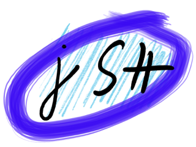
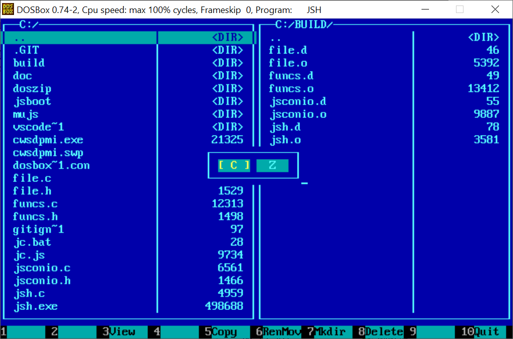

# jSH

## A Javascript scripting engine for DOS
[jSH](https://github.com/SuperIlu/jSH) is a script interpreter for DOS based operating systems like MS-DOS, [FreeDOS](http://freedos.org/) or any DOS based Windows (like 95, 98, ME). The focus is on file io and text mode user interfaces.

jSH is a side project to [DOjS](https://github.com/SuperIlu/DOjS), a Javascript canvas for creative coding.

The following script e.g. renames all file extensions in a given directory:
```Javascript
if (args.length < 3) {
	Println("Usage:");
	Println("   jSH.exe renall.js <dir> <old ext> <new ext>");
	Exit(1);
}

var dir = args[0];
var oldExt = args[1].toUpperCase();
var newExt = args[2].toUpperCase();

var files = List(dir);
for (var i = 0; i < files.length; i++) {
	var oldName = files[i].toUpperCase();
	if (oldName.lastIndexOf(oldExt) != -1) {
		var baseName = oldName.substring(0, oldName.lastIndexOf(oldExt));
		var newName = baseName + newExt;
		Println(dir + "\\" + oldName + " => " + dir + "\\" + newName);
		Rename(dir + "\\" + oldName, dir + "\\" + newName);
	}
}
Println("All done...");
```
And can be run like this: `JSH.EXE RENALL.JS SOMEDIR .FOO .BAR` to rename all files ending in `.FOO` to `.BAR`.

jSH was only possible due to the work of these people/projects:
* [MuJS](https://mujs.com/) JavaScript interpreter
* [DJGPP](http://www.delorie.com/djgpp/) from DJ Delorie and the [Linux compile scripts](https://github.com/andrewwutw/build-djgpp) by Andrew Wu.

You can find me on [Twitter](https://twitter.com/dec_hl) if you want...

# Download and quick start
**You can find binary releases on the [GitHub release page](https://github.com/SuperIlu/jSH/releases). Just extract the contents of the archive and run jSH.**

jSH runs in [Dosbox](https://www.dosbox.com/) and on real hardware or a virtual machine with MS-DOS, [FreeDOS](https://www.freedos.org/) or any DOS based Windows like Windows 95/98/ME.

If you run it on real hardware you need at least a **80386 with 4MB**. I recommend a **Pentium class machine with at least 8MB RAM**.

The API is documented in the [doc/html/](http://htmlpreview.github.io/?https://github.com/SuperIlu/jSH/blob/master/doc/html/index.html) directory.

For now jSH comes only with a single bigger example: *JsCommander*. A minimal file manager in the style of the well known Norton Commander.


## additional packages
jSH has a very simple integrated package manager (JPM). It can be started with `JPM.BAT`.
A working packet driver is needed to connect to the package index and download packages using HTTPS.
Packages (and the package index) are fetched from the [DOjS/jSH package repository](https://github.com/SuperIlu/DOjSHPackages).
Downloaded packages are put into `JSBOOT.ZIP` in the `PACKAGE/` directory.
Feel free to submit any packages you want to include in that repository using a pull request.
DPM commands:
  * installed - list installed packages.
  * remove    - remove package.
  * fetch     - fetch package index from server.
  * install   - install a package (and its dependencies) from package index.
  * list      - list available packages in index.
  * setindex  - set index URL (HTTP or HTTPS).
  * help      - this help.;
  * quit      - exit dpm.

# Compilation
You can compile jSH on any modern Linux (the instructions below are for Debian based distributions) or on Windows 10 using Windows Subsystem for Linux (WSL).
Setup Windows Subsystem for Linux (WSL) according to [this](https://docs.microsoft.com/en-us/windows/wsl/install-win10) guide (I used Ubuntu 18.04 LTS).

## Preparation
Build and install DJGPP 7.2.0 according to [this](https://github.com/andrewwutw/build-djgpp) guide.
I used the following command lines to update/install my dependencies:
```bash
sudo apt-get update
sudo apt-get dist-upgrade
sudo apt-get install bison flex curl gcc g++ make texinfo zlib1g-dev g++ unzip htop screen git bash-completion build-essential npm python-yaml zip dos2unix python3
sudo npm install -g jsdoc
sudo npm install -g better-docs
```

And the following commands to build and install DJGPP to `/home/ilu/djgpp`.:
```bash
git clone https://github.com/andrewwutw/build-djgpp.git
cd build-djgpp
export DJGPP_PREFIX=/home/ilu/djgpp
./build-djgpp.sh 7.2.0
```

Make sure `dxe3gen` and `dxe3res` are installed as well and set `DJPATH` permanently to your installation directory of DJGPP.

## Getting & Compiling jSH
Open a shell/command line in the directory where you want the source to reside.

Checkout jSH from Github:
```bash
git clone https://github.com/SuperIlu/jSH.git
```

Open the Makefile in a text editor and change the path to DJGPP according to your installation.

Now you are ready to compile jSH with `make clean all`. This might take some time as the dependencies are quite a large.
`make distclean` will clean dependencies as well. `make zip` will create the distribution ZIP and `make doc` will re-create the HTML help.

## Creating native libraries (DXEs)
Have a look at the example libraries in `test.dxelib/` and `test2.dxelib/`. Some rules:
* A library called `foo` must have the filename `foo.dxe` and must provide at least the function `void init_foo(js_State *J)`. This function is called when the library is loaded and can then register global variables/objects/classes/function in the Javascript runtime.
* The library may also provide the function `void shutdown_foo(void)` (this is completely optional). This will get called during shutdown and can perform cleanup.
* All libraries in the sourcetree will be build by the `make all` target if their dir-name ends with `.dxelib`. The Makefile in the directory must provide the targets all, clean and distclean (see examples).
* Libraries should use the `Makefile.dxemk` whenever possible.
* In theory it should be possible to compile additional native libraries without re-compiling `jSH.EXE` if the same compiler is used (see above). 
* Native libraries may use all functions from `mujs.h` and all functions in `dxetemplate.txt`. If additional functions are needed these need to be included in the template and `jSH.EXE` must be recompiled!
* When libraries are compiled the exports provided by jSH are checked against the used functions (see `check_exports.py`) and the build fails if there are symbols missing.
* Feel free to provide your native libraries and/or changes to `dxetemplate.txt` for inclusion in the jSH GitHub repository (MIT license please)...

# History
See the [changelog](/CHANGELOG.md) for the projects history.

# Licenses
## jSH
All code from me is released under **MIT license**.

## MuJS
MuJS is released under **ISC license**. See *COPYING* in the MuJS folder for details.

## DZComm
DZComm serial library is release as **gift-ware**. See *readme.txt* in the dzcomm folder for details.

## CWSDPMI.EXE
[CWSDPMI](http://sandmann.dotster.com/cwsdpmi/) DPMI host is licensed under **GPL**. The documentation states:
> The files in this binary distribution may be redistributed under the GPL (with source) or without the source code provided.

## zip code
[zip](https://github.com/kuba--/zip) is licensed by UNLICENSE

## WATTCP
WATTCP - TCP/IP library routines

Copyright (c) 1990, 1991, 1992, 1993 Erick Engelke

Portions Copyright (c) 1993  Quentin Smart
Portions Copyright (c) 1991  University of Waterloo
Portions Copyright (c) 1990  National Center for Supercomputer Applications
Portions Copyright (c) 1990  Clarkson University
Portions Copyright (c) 1983, 1986, Imagen Corporation

    This software is distributed in the hope that it will be useful,
    but without any warranty; without even the implied warranty of
    merchantability or fitness for a particular purpose.

**RESTRICTIONS**
You may freely use this library to produce programs which you may give
away or sell in source format, or as compiled executables, or both.

You may not sell this library or a portion thereof or distribute modified
versions the library code in either source or OBJect or LIBrary format
without written permission from the author.  The author still maintains
copyright privileges and will assert the privileges of ownership for
purposes of royalties such distributions.

Portions of this code were written or enhanced by others and offerred
to me for distribution in WATTCP under my copyright.  To my knowledge,
all copyrights exercised are listed at the top of this file.  If this
is incorrect, please contact me so I can rectify the situation.
